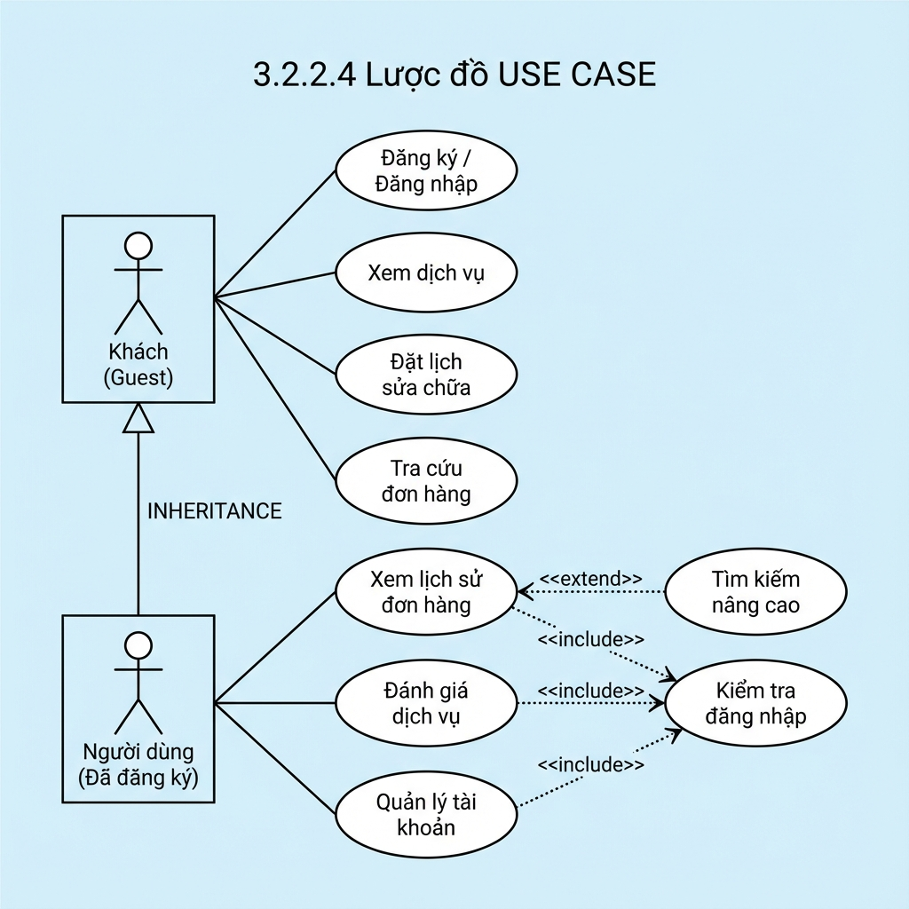

# 📊 Lược đồ USE CASE - Khách hàng (Customer View)

## 🎯 Tổng quan

Tài liệu này mô tả chi tiết sơ đồ Use Case cho **phía khách hàng** của hệ thống **Website Dịch Vụ Sửa Chữa Nhà Cửa - Nguyễn Hoàng Anh**, bao gồm các chức năng dành cho Khách (Guest) và Người dùng đã đăng ký (Registered User).

---

## 👥 Các Actor (Tác nhân)

### 1. **Khách (Guest)** 🚶

**Mô tả**: Người truy cập website chưa đăng ký hoặc chưa đăng nhập vào hệ thống.

**Đặc điểm**:
- Không cần tài khoản để sử dụng các chức năng cơ bản
- Có thể đặt lịch sửa chữa mà không cần đăng nhập
- Có thể tra cứu đơn hàng bằng số điện thoại

**Quyền hạn**:
- ✅ Xem thông tin dịch vụ
- ✅ Đăng ký tài khoản mới
- ✅ Đăng nhập vào hệ thống
- ✅ Đặt lịch sửa chữa
- ✅ Tra cứu đơn hàng bằng số điện thoại

---

### 2. **Người dùng (Đã đăng ký)** 👤

**Mô tả**: Khách hàng đã đăng ký tài khoản và đăng nhập vào hệ thống.

**Quan hệ**: Kế thừa (Generalization) từ **Khách (Guest)**

**Đặc điểm**:
- Có tài khoản với email và mật khẩu
- Được lưu lịch sử đơn hàng
- Có thể đánh giá dịch vụ sau khi hoàn thành

**Quyền hạn**:
- ✅ **Kế thừa tất cả quyền của Khách**:
  - Xem dịch vụ
  - Đặt lịch sửa chữa
  - Tra cứu đơn hàng
  - Đăng nhập/Đăng ký
- ✅ **Quyền bổ sung**:
  - Xem lịch sử đơn hàng của mình
  - Đánh giá dịch vụ sau khi hoàn thành
  - Quản lý thông tin tài khoản
  - Đổi mật khẩu

---

## 🔄 Các Use Case (Chức năng)

### 📌 Use Case cho Khách (Guest)

#### UC-01: Đăng ký / Đăng nhập
- **ID**: UC-01
- **Tên**: Đăng ký / Đăng nhập
- **Actor**: Khách
- **Mô tả**: Tạo tài khoản mới hoặc đăng nhập vào hệ thống
- **Độ ưu tiên**: Cao
- **Điều kiện tiên quyết**: Không có
- **Điều kiện sau**: 
  - Đăng ký: Tài khoản mới được tạo với role "Customer"
  - Đăng nhập: User được xác thực và chuyển sang trạng thái "Người dùng"

**Luồng chính (Đăng ký)**:
1. Khách chọn "Đăng ký"
2. Hệ thống hiển thị form đăng ký
3. Khách điền thông tin:
   - Họ tên
   - Email
   - Số điện thoại
   - Mật khẩu
   - Xác nhận mật khẩu
4. Khách nhấn "Đăng ký"
5. Hệ thống kiểm tra thông tin:
   - Email chưa tồn tại
   - Mật khẩu khớp với xác nhận
   - Số điện thoại hợp lệ
6. Hệ thống tạo tài khoản mới
7. Tự động đăng nhập
8. Chuyển về trang chủ

**Luồng chính (Đăng nhập)**:
1. Khách chọn "Đăng nhập"
2. Hệ thống hiển thị form đăng nhập
3. Khách nhập Email và Mật khẩu
4. Khách nhấn "Đăng nhập"
5. Hệ thống xác thực thông tin
6. Đăng nhập thành công
7. Chuyển về trang chủ

**Luồng thay thế**:
- **5a**: Email đã tồn tại
  - Hệ thống thông báo "Email đã được sử dụng"
  - Quay lại bước 3
- **5b**: Mật khẩu không khớp
  - Hệ thống thông báo "Mật khẩu xác nhận không khớp"
  - Quay lại bước 3
- **5c**: Sai email hoặc mật khẩu (Đăng nhập)
  - Hệ thống thông báo "Email hoặc mật khẩu không đúng"
  - Quay lại bước 3

---

#### UC-02: Xem dịch vụ
- **ID**: UC-02
- **Tên**: Xem dịch vụ
- **Actor**: Khách
- **Mô tả**: Xem danh sách các dịch vụ sửa chữa và bảng giá
- **Độ ưu tiên**: Trung bình
- **Điều kiện tiên quyết**: Không có

**Luồng chính**:
1. Khách truy cập trang chủ
2. Hệ thống hiển thị danh sách dịch vụ:
   - 🔌 Sửa chữa điện
   - 💧 Sửa chữa nước
   - 🎨 Sơn sửa
   - 🛡️ Chống thấm
   - 🔧 Sửa chữa tổng hợp
3. Khách xem thông tin chi tiết từng dịch vụ
4. Khách xem bảng giá dịch vụ cơ bản

---

#### UC-03: Đặt lịch sửa chữa
- **ID**: UC-03
- **Tên**: Đặt lịch sửa chữa
- **Actor**: Khách
- **Mô tả**: Tạo đơn đặt lịch sửa chữa nhà cửa
- **Độ ưu tiên**: Cao
- **Điều kiện tiên quyết**: Không có (không bắt buộc đăng nhập)
- **Điều kiện sau**: Đơn hàng được tạo với trạng thái "Mới"

**Luồng chính**:
1. Khách chọn "Đặt lịch sửa chữa"
2. Hệ thống hiển thị form đặt lịch
3. Khách điền thông tin:
   - Họ tên
   - Số điện thoại
   - Ngày hẹn sửa chữa
   - Địa chỉ sửa chữa
   - Loại dịch vụ (chọn từ dropdown)
   - Mô tả sự cố
4. Hệ thống hiển thị ước tính chi phí dựa trên bảng giá
5. Khách xác nhận đặt lịch
6. Hệ thống tạo đơn hàng mới
7. Hệ thống hiển thị trang thành công với:
   - Mã đơn hàng
   - Thông tin đã đặt
   - Hướng dẫn tra cứu

**Luồng thay thế**:
- **3a**: Khách đã đăng nhập
  - Hệ thống tự động điền họ tên và số điện thoại
  - Liên kết đơn hàng với tài khoản
- **5a**: Ngày hẹn không hợp lệ (trong quá khứ)
  - Hệ thống thông báo lỗi
  - Quay lại bước 3

---

#### UC-04: Tra cứu đơn hàng
- **ID**: UC-04
- **Tên**: Tra cứu đơn hàng
- **Actor**: Khách
- **Mô tả**: Tra cứu trạng thái đơn hàng bằng số điện thoại
- **Độ ưu tiên**: Trung bình
- **Điều kiện tiên quyết**: Không có

**Luồng chính**:
1. Khách chọn "Tra cứu đơn hàng"
2. Hệ thống hiển thị form tra cứu
3. Khách nhập số điện thoại
4. Khách nhấn "Tra cứu"
5. Hệ thống tìm kiếm đơn hàng theo số điện thoại
6. Hệ thống hiển thị danh sách đơn hàng:
   - Mã đơn hàng
   - Ngày đặt
   - Loại dịch vụ
   - Trạng thái
   - Địa chỉ
7. Khách xem chi tiết từng đơn

**Luồng thay thế**:
- **5a**: Không tìm thấy đơn hàng
  - Hệ thống thông báo "Không tìm thấy đơn hàng với số điện thoại này"
  - Quay lại bước 3

---

### 📌 Use Case cho Người dùng (Đã đăng ký)

#### UC-05: Xem lịch sử đơn hàng
- **ID**: UC-05
- **Tên**: Xem lịch sử đơn hàng
- **Actor**: Người dùng
- **Mô tả**: Xem tất cả đơn hàng đã đặt
- **Độ ưu tiên**: Cao
- **Include**: UC-07 (Kiểm tra đăng nhập)
- **Extend**: UC-08 (Tìm kiếm nâng cao)
- **Điều kiện tiên quyết**: Đã đăng nhập
- **Điều kiện sau**: Hiển thị danh sách đơn hàng

**Luồng chính**:
1. Người dùng đăng nhập vào hệ thống
2. **<<include>> Kiểm tra đăng nhập** (UC-07)
3. Người dùng chọn "Lịch sử đơn hàng"
4. Hệ thống lấy danh sách đơn hàng của user
5. Hệ thống hiển thị danh sách đơn hàng:
   - Mã đơn hàng
   - Ngày đặt
   - Loại dịch vụ
   - Trạng thái
   - Địa chỉ
   - Ước tính chi phí
6. Người dùng xem chi tiết từng đơn
7. **<<extend>> Tìm kiếm nâng cao** (UC-08) - Tùy chọn

**Luồng thay thế**:
- **4a**: Chưa có đơn hàng nào
  - Hệ thống hiển thị "Bạn chưa có đơn hàng nào"
  - Hiển thị nút "Đặt lịch ngay"

---

#### UC-06: Đánh giá dịch vụ
- **ID**: UC-06
- **Tên**: Đánh giá dịch vụ
- **Actor**: Người dùng
- **Mô tả**: Đánh giá chất lượng dịch vụ sau khi hoàn thành
- **Độ ưu tiên**: Cao
- **Include**: UC-07 (Kiểm tra đăng nhập)
- **Điều kiện tiên quyết**: 
  - Đã đăng nhập
  - Đơn hàng đã hoàn thành
  - Chưa đánh giá trước đó
- **Điều kiện sau**: Đánh giá được lưu và hiển thị công khai

**Luồng chính**:
1. Người dùng đăng nhập vào hệ thống
2. **<<include>> Kiểm tra đăng nhập** (UC-07)
3. Người dùng vào "Lịch sử đơn hàng"
4. Hệ thống hiển thị danh sách đơn hàng
5. Người dùng chọn đơn đã hoàn thành
6. Người dùng nhấn "Đánh giá"
7. Hệ thống kiểm tra:
   - Đơn hàng đã hoàn thành
   - Chưa có đánh giá
8. Hệ thống hiển thị form đánh giá
9. Người dùng chọn số sao (1-5)
10. Người dùng viết nhận xét
11. Người dùng nhấn "Gửi đánh giá"
12. Hệ thống lưu đánh giá
13. Hệ thống hiển thị thông báo thành công

**Luồng thay thế**:
- **7a**: Đơn hàng chưa hoàn thành
  - Hệ thống thông báo "Chỉ có thể đánh giá đơn hàng đã hoàn thành"
  - Kết thúc
- **7b**: Đã đánh giá trước đó
  - Hệ thống hiển thị đánh giá cũ
  - Cho phép chỉnh sửa (tùy chọn)

---

#### UC-07: Kiểm tra đăng nhập
- **ID**: UC-07
- **Tên**: Kiểm tra đăng nhập
- **Actor**: Hệ thống
- **Mô tả**: Xác thực người dùng đã đăng nhập
- **Độ ưu tiên**: Cao
- **Được include bởi**:
  - UC-05 (Xem lịch sử đơn hàng)
  - UC-06 (Đánh giá dịch vụ)
  - UC-09 (Quản lý tài khoản)

**Luồng chính**:
1. Hệ thống kiểm tra session/cookie
2. Nếu đã đăng nhập → Tiếp tục
3. Nếu chưa đăng nhập → Chuyển đến trang đăng nhập

---

#### UC-08: Tìm kiếm nâng cao
- **ID**: UC-08
- **Tên**: Tìm kiếm nâng cao
- **Actor**: Người dùng
- **Mô tả**: Lọc đơn hàng theo nhiều tiêu chí
- **Độ ưu tiên**: Thấp
- **Extend cho**: UC-05 (Xem lịch sử đơn hàng)

**Luồng chính**:
1. Người dùng đang xem lịch sử đơn hàng
2. Người dùng chọn "Lọc"
3. Hệ thống hiển thị các tùy chọn lọc:
   - Trạng thái (Tất cả/Mới/Đã xác nhận/Đang xử lý/Hoàn thành/Hủy)
   - Khoảng thời gian (Từ ngày - Đến ngày)
   - Loại dịch vụ
4. Người dùng chọn tiêu chí lọc
5. Người dùng nhấn "Áp dụng"
6. Hệ thống lọc và hiển thị kết quả

---

#### UC-09: Quản lý tài khoản
- **ID**: UC-09
- **Tên**: Quản lý tài khoản
- **Actor**: Người dùng
- **Mô tả**: Xem và cập nhật thông tin cá nhân
- **Độ ưu tiên**: Trung bình
- **Include**: UC-07 (Kiểm tra đăng nhập)
- **Điều kiện tiên quyết**: Đã đăng nhập

**Luồng chính**:
1. Người dùng đăng nhập vào hệ thống
2. **<<include>> Kiểm tra đăng nhập** (UC-07)
3. Người dùng chọn "Tài khoản"
4. Hệ thống hiển thị thông tin hiện tại:
   - Họ tên
   - Email (không thể sửa)
   - Số điện thoại
5. Người dùng cập nhật thông tin:
   - Họ tên
   - Số điện thoại
6. Người dùng nhấn "Lưu thay đổi"
7. Hệ thống kiểm tra thông tin
8. Hệ thống cập nhật thông tin
9. Hệ thống hiển thị thông báo thành công

**Luồng phụ (Đổi mật khẩu)**:
1. Người dùng chọn "Đổi mật khẩu"
2. Hệ thống hiển thị form đổi mật khẩu
3. Người dùng nhập:
   - Mật khẩu hiện tại
   - Mật khẩu mới
   - Xác nhận mật khẩu mới
4. Người dùng nhấn "Đổi mật khẩu"
5. Hệ thống kiểm tra:
   - Mật khẩu hiện tại đúng
   - Mật khẩu mới khớp với xác nhận
6. Hệ thống cập nhật mật khẩu
7. Hệ thống hiển thị thông báo thành công

**Luồng thay thế**:
- **5a**: Mật khẩu hiện tại không đúng
  - Hệ thống thông báo "Mật khẩu hiện tại không đúng"
  - Quay lại bước 3
- **5b**: Mật khẩu mới không khớp
  - Hệ thống thông báo "Mật khẩu xác nhận không khớp"
  - Quay lại bước 3

---

## 🔗 Các mối quan hệ (Relationships)

### 1. **Kế thừa (Generalization)** ⬆️

```
Người dùng (Đã đăng ký) ──▷ Khách (Guest)
```

**Ý nghĩa**: 
- Người dùng đã đăng ký **kế thừa tất cả quyền** của Khách
- Người dùng có thể làm mọi thứ mà Khách có thể làm
- Người dùng có thêm các quyền riêng biệt

**Quyền kế thừa**:
- ✅ Xem dịch vụ
- ✅ Đặt lịch sửa chữa
- ✅ Tra cứu đơn hàng
- ✅ Đăng nhập/Đăng ký

**Quyền bổ sung (chỉ Người dùng)**:
- ✅ Xem lịch sử đơn hàng
- ✅ Đánh giá dịch vụ
- ✅ Quản lý tài khoản

---

### 2. **Include (Bao gồm)** 📥

Mối quan hệ `<<include>>` biểu thị use case này **bắt buộc** phải thực hiện use case khác.

```
Xem lịch sử đơn hàng ──<<include>>──▷ Kiểm tra đăng nhập
Đánh giá dịch vụ ──<<include>>──▷ Kiểm tra đăng nhập
Quản lý tài khoản ──<<include>>──▷ Kiểm tra đăng nhập
```

**Ý nghĩa**:
- Trước khi thực hiện các use case này, **bắt buộc** phải kiểm tra đăng nhập
- Nếu chưa đăng nhập → Chuyển đến trang đăng nhập
- Nếu đã đăng nhập → Tiếp tục thực hiện use case

**Triển khai**:
- Sử dụng `[Authorize]` attribute trong ASP.NET Core
- Middleware xác thực tự động kiểm tra

---

### 3. **Extend (Mở rộng)** 📤

Mối quan hệ `<<extend>>` biểu thị use case **tùy chọn** có thể mở rộng use case gốc.

```
Tìm kiếm nâng cao ──<<extend>>──▷ Xem lịch sử đơn hàng
```

**Ý nghĩa**:
- Khi xem lịch sử đơn hàng, người dùng **có thể** (không bắt buộc) sử dụng tìm kiếm nâng cao
- Tìm kiếm nâng cao là tính năng **mở rộng**, không phải tính năng cốt lõi

**Tiêu chí lọc**:
- Trạng thái đơn hàng
- Khoảng thời gian
- Loại dịch vụ

---

## 📊 Sơ đồ Use Case



---

## 📋 Bảng tổng hợp Use Case

| ID | Tên Use Case | Actor | Độ ưu tiên | Include | Extend |
|----|--------------|-------|------------|---------|--------|
| UC-01 | Đăng ký / Đăng nhập | Khách | Cao | - | - |
| UC-02 | Xem dịch vụ | Khách | Trung bình | - | - |
| UC-03 | Đặt lịch sửa chữa | Khách | Cao | - | - |
| UC-04 | Tra cứu đơn hàng | Khách | Trung bình | - | - |
| UC-05 | Xem lịch sử đơn hàng | Người dùng | Cao | UC-07 | UC-08 |
| UC-06 | Đánh giá dịch vụ | Người dùng | Cao | UC-07 | - |
| UC-07 | Kiểm tra đăng nhập | Hệ thống | Cao | - | - |
| UC-08 | Tìm kiếm nâng cao | Hệ thống | Thấp | - | - |
| UC-09 | Quản lý tài khoản | Người dùng | Trung bình | UC-07 | - |

---

## 🎯 Luồng nghiệp vụ chính

### Luồng 1: Khách đặt lịch (Không đăng nhập)

```
1. Khách truy cập website
   ↓
2. Xem dịch vụ (UC-02)
   ↓
3. Đặt lịch sửa chữa (UC-03)
   ↓
4. Nhận mã đơn hàng
   ↓
5. Tra cứu đơn hàng bằng SĐT (UC-04)
```

---

### Luồng 2: Khách đăng ký và sử dụng đầy đủ

```
1. Khách truy cập website
   ↓
2. Đăng ký tài khoản (UC-01)
   ↓
3. Tự động đăng nhập
   ↓
4. Đặt lịch sửa chữa (UC-03)
   ↓
5. Đơn hàng được liên kết với tài khoản
   ↓
6. Xem lịch sử đơn hàng (UC-05 + UC-07)
   ↓
7. [Tùy chọn] Tìm kiếm nâng cao (UC-08)
```

---

### Luồng 3: Người dùng đánh giá dịch vụ

```
1. Người dùng đăng nhập (UC-01)
   ↓
2. Kiểm tra đăng nhập (UC-07)
   ↓
3. Xem lịch sử đơn hàng (UC-05)
   ↓
4. Chọn đơn đã hoàn thành
   ↓
5. Đánh giá dịch vụ (UC-06)
   ↓
6. Gửi đánh giá thành công
```

---

### Luồng 4: Người dùng quản lý tài khoản

```
1. Người dùng đăng nhập (UC-01)
   ↓
2. Kiểm tra đăng nhập (UC-07)
   ↓
3. Vào "Tài khoản" (UC-09)
   ↓
4. Cập nhật thông tin cá nhân
   ↓
5. [Tùy chọn] Đổi mật khẩu
   ↓
6. Lưu thay đổi
```

---

## 🔐 Ma trận phân quyền

| Use Case | Khách | Người dùng | Yêu cầu đăng nhập |
|----------|-------|------------|-------------------|
| Đăng ký / Đăng nhập | ✅ | ✅ | ❌ |
| Xem dịch vụ | ✅ | ✅ | ❌ |
| Đặt lịch sửa chữa | ✅ | ✅ | ❌ |
| Tra cứu đơn hàng | ✅ | ✅ | ❌ |
| Xem lịch sử đơn hàng | ❌ | ✅ | ✅ |
| Đánh giá dịch vụ | ❌ | ✅ | ✅ |
| Quản lý tài khoản | ❌ | ✅ | ✅ |

---

## 📝 Ghi chú triển khai

### Quy ước ký hiệu UML
- **Hình chữ nhật**: Actor (tác nhân)
- **Hình oval**: Use Case (chức năng)
- **Đường liền**: Liên kết giữa Actor và Use Case
- **Đường liền + Mũi tên rỗng**: Quan hệ kế thừa (Generalization)
- **Đường đứt nét + <<include>>**: Quan hệ bao gồm (bắt buộc)
- **Đường đứt nét + <<extend>>**: Quan hệ mở rộng (tùy chọn)

### Lưu ý kỹ thuật

1. **Kiểm tra đăng nhập**:
   - Implement bằng `[Authorize]` attribute
   - Middleware tự động redirect đến `/Account/Login`

2. **Kế thừa Actor**:
   - Người dùng đã đăng ký vẫn có thể sử dụng tất cả chức năng của Khách
   - Không cần code riêng, chỉ cần kiểm tra `User.Identity.IsAuthenticated`

3. **Liên kết đơn hàng**:
   - Nếu đăng nhập: `Booking.UserId = currentUserId`
   - Nếu không đăng nhập: `Booking.UserId = null`

4. **Đánh giá**:
   - Kiểm tra `Booking.Status == "Hoàn thành"`
   - Kiểm tra chưa có `Review` với `BookingId` tương ứng

---

## 🎨 Thiết kế UI/UX

### Trải nghiệm người dùng

**Khách (Guest)**:
- Giao diện đơn giản, dễ sử dụng
- Không bắt buộc đăng nhập để đặt lịch
- Có thể tra cứu đơn hàng bằng SĐT

**Người dùng (Đã đăng ký)**:
- Tự động điền thông tin khi đặt lịch
- Xem lịch sử đơn hàng đầy đủ
- Có thể đánh giá và quản lý tài khoản

### Responsive Design
- ✅ Desktop: Hiển thị đầy đủ thông tin
- ✅ Tablet: Tối ưu layout
- ✅ Mobile: Menu hamburger, form đơn giản

---

## 📞 Thông tin dự án

**Sinh viên**: Nguyễn Hoàng Anh  
**Lớp**: DK24TTC2  
**Môn học**: Phát triển ứng dụng web với ASP.NET Core  
**Ngày tạo**: 25/11/2025  
**Phiên bản**: v2.0.0

---

**© 2025 - Website Dịch Vụ Sửa Chữa Nhà Cửa - Nguyễn Hoàng Anh**
